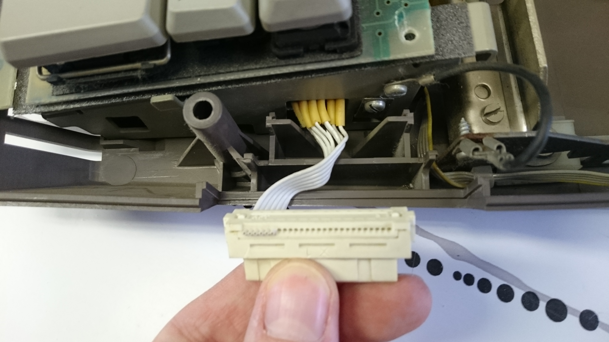
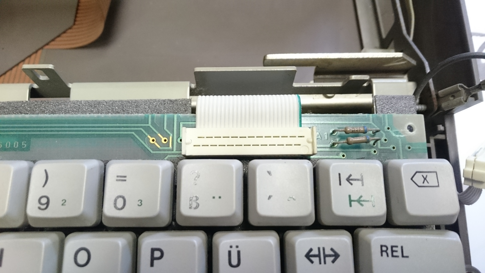
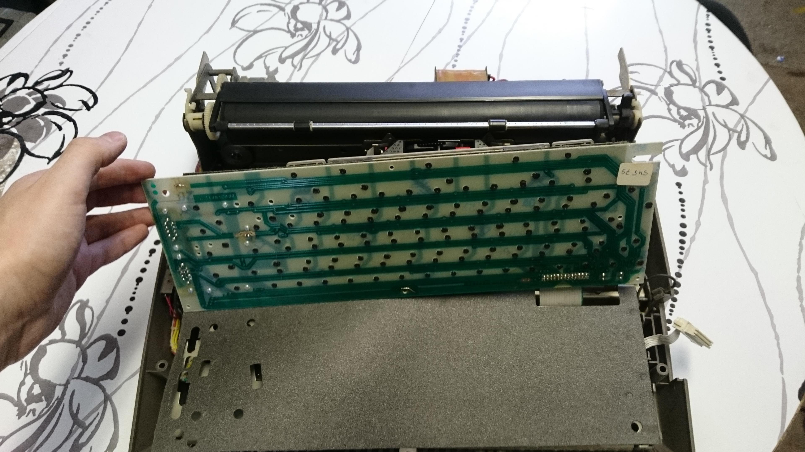
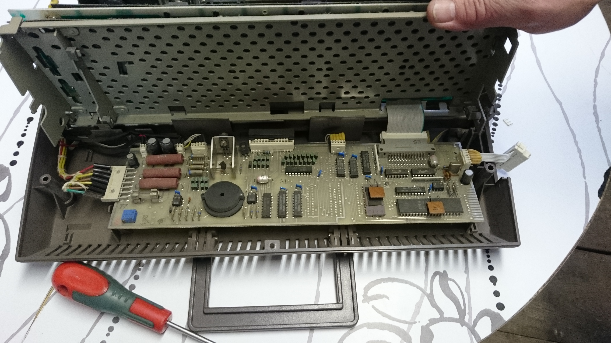
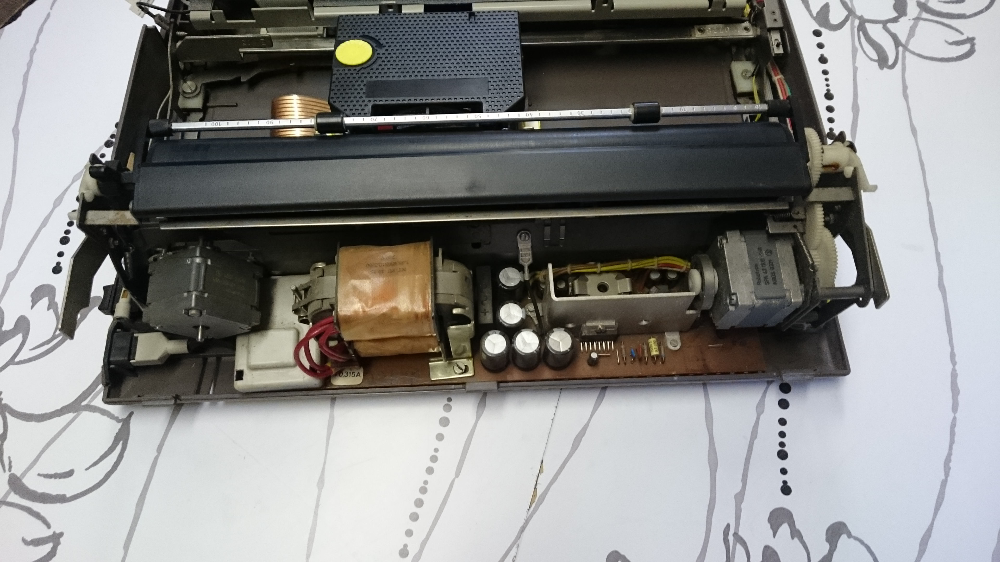

.. contents:: Table of Contents
.. section-numbering::

======================================
 Felix' Service Manual for Erika 3004 
======================================

.. Important::
	Disclaimer goes here ... TL;DR: Don't blame me and don't be stupid !

Opening The Case
================

1. Turn your Erika upside down.
2. Locate the 3 flat-head screws.

..	image::	img/ScrewPositions.png
	:alt:	positions of flat-head screws
	:width:	50%

3. Turn Erika right side up again.
4. Carefully remove the top casing by lifting up the front and sliding to the back.

> Be careful not to break one of the three clips at the back. 

.. image:: img/PositionOfClips.png
   :width: 50%

(View from the back.)

Interface Connector
===================

Make sure the interface connector is correctly orientated.
Mine was upside down as shown here:

I had to flip it so the ribbon cable is on the right side of the connector (like this).

..	image::	img/ConnectorCorrect.JPG
	:alt:	positions of clips
	:width: 50%

..	image::	img/ConnectorCorrect2.JPG
	:alt:	positions of clips
	:width: 50%

.. note::	Only 6 of the 26 pins are connected and used!

Keyboard
========

The Keyboard is connected with the mainboard via a ribbon cable as shown here:

While trying to unplug the cable i broke off the left side of the connector.
I therefore can not comment whether it is safe to unplug it and would recommend against removing it, if not necessary.

.. note::	If you know how to do this properly please make a PR.

Even without unplugging the cable and without removing any further screws it's possible to lift up the keyboard (eg. for cleaning).

Mainboard
=========

Beneath the keyboard lies the mainboard of the typewriter.
To access it, disconnect the two cables shown in this image:

.. image::	img/RFCables.png
	:alt:	Position of Cables connected to the RF-Shielding
	:width:	50%

Then carefully lift up the rf-cage? below the keyboard together with the keyboard.

.. note::	My machine had a sponge below the mainboard right under the keyboard cable. I don't know the reason for it being there, but i made sure it stayed in its position when putting everything back together.

Here's a shot of cpu and eprom:

..	image::	img/CPU_EPROM.JPG
	:alt:	CPU and EPROM
	:width:	50%

.. tip::	More images can be found in the [`mainboard`](./img/mainboard) sub-folder.

Power Supply
============

Nothing to say here.

Imprint
=======

.. figure:: img/Imprint.JPG
	:alt:	Imprint
	:width: 50%
	
	I found this sticker on the bottom of my machine.